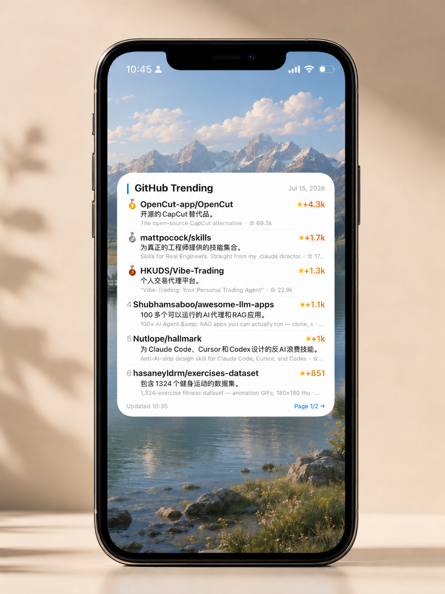

# GitHub Trending Widget 📊

一个 iOS Scriptable 桌面小组件，每天展示 GitHub Trending 热门项目，支持中文摘要。



## ✨ 功能

- 🏆 每页显示 6 个 trending repo，每小时自动轮播
- 🥇🥈🥉 前三名奖牌展示
- ★ 今日新增 star 数（按热度渐变：🔥橙 → 🌟金 → ⚪灰）
- 🇨🇳 AI 生成中文一句话摘要（Cloudflare Workers AI）
- ☆ Total stars + 英文原描述
- 点击 widget 跳转 github.com/trending

## 🛠️ 架构

```
iOS Widget (Scriptable)
    ↓ fetch JSON
Cloudflare Worker (your-worker.workers.dev)
    ↓ scrape + AI summarize
GitHub Trending Page
```

- **数据源**: 每 4 小时抓取 GitHub Trending 页面
- **中文摘要**: Cloudflare Workers AI (Llama 3.3 70B)
- **缓存**: Cloudflare KV，4 小时 TTL
- **排序**: 按今日 star 数降序

## 📱 安装步骤

### 1. 安装 Scriptable
从 App Store 下载 [Scriptable](https://apps.apple.com/app/scriptable/id1405459188)

### 2. 创建脚本
1. 打开 Scriptable → 点 + 新建脚本
2. 复制 `scriptable/GitHub Trending.js` 的全部内容粘贴进去
3. 点 ▶️ Run 测试能否正常显示

### 3. 添加桌面 Widget
1. 回桌面 → 长按空白处 → 点 +
2. 搜索 Scriptable → 选 **Large** 尺寸
3. 长按 widget → 编辑小组件 → Script 选你的脚本名

## 🚀 自部署 Worker（可选）

如果你想用自己的 Cloudflare 账号：

1. `cd worker/`
2. 修改 `wrangler.toml` 中的 KV namespace ID
3. `npx wrangler kv namespace create TRENDING_CACHE`
4. `npx wrangler deploy`
5. 修改 Scriptable 代码中的 `ENDPOINT` 为你的 Worker URL

### 前置要求
- Cloudflare 账号（免费即可）
- Workers AI 已启用（免费额度充足）
- Node.js 18+

## 📁 项目结构

```
├── scriptable/
│   └── GitHub Trending.js    # iOS Scriptable 小组件代码
├── worker/
│   ├── index.js              # Cloudflare Worker 后端
│   └── wrangler.toml         # Worker 配置
├── preview.png               # 效果预览图
└── README.md
```

## 📄 License

MIT
